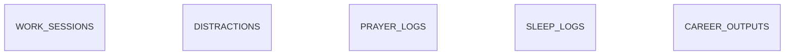

# Personal Analytics Backend

FastAPI + SQLAlchemy + SQLite backend for low-friction personal work,
distraction, sleep, prayer, and career-output logging. The analytics layer is
local-only and uses pandas; it does not call external services.

## Quick start

Run these commands from the `backend` directory:

```powershell
python -m venv venv
.\venv\Scripts\Activate.ps1
pip install -r requirements.txt
alembic upgrade head
uvicorn app.main:app --reload
```

The API is available at `http://127.0.0.1:8000`.

- Swagger UI: `http://127.0.0.1:8000/docs`
- ReDoc: `http://127.0.0.1:8000/redoc`
- OpenAPI schema: `http://127.0.0.1:8000/openapi.json`

The backend is a local-first, single-user application. It does not require
authentication and does not send data to external services.

## Development commands

Run these from `backend` after activating the virtual environment:

```powershell
pytest -q
ruff check app alembic tests
python scripts/check_openapi.py
alembic upgrade head
```

The OpenAPI check compares the current schema with
`docs/openapi.before.json` and protects endpoint and response compatibility.

## Configuration

Settings use the `ANALYTICS_` environment-variable prefix. Defaults are
suitable for local development:

| Variable | Default | Purpose |
|---|---|---|
| `ANALYTICS_DATABASE_URL` | `sqlite:///./analytics.db` | Database URL |
| `ANALYTICS_TIMEZONE` | `Asia/Kolkata` | Local date and display calculations |
| `ANALYTICS_DEEP_WORK_MIN_MINUTES` | `25` | Deep-work threshold |
| `ANALYTICS_DAILY_DEEP_TARGET_MIN` | `240` | Daily deep-work target |
| `ANALYTICS_DAILY_DISTRACTION_CAP_MIN` | `120` | Daily distraction cap |
| `ANALYTICS_DAILY_CAREER_TARGET_UNITS` | `3` | Daily career-output target |

For example:

```powershell
$env:ANALYTICS_DATABASE_URL = "sqlite:///./analytics.db"
$env:ANALYTICS_TIMEZONE = "Asia/Kolkata"
```

## Demo data

```powershell
python scripts/seed.py
```

The seed is deterministic (60 days, random seed 42) and replaces existing
domain data. It is intended for local demos only.

## API overview

- `GET /health` — health check
- `/sessions` — start, stop, create, list, and delete work sessions
- `/distractions` — start, stop, create, list, and delete distractions
- `/sleep` — create, list, and delete sleep logs
- `/prayers` — update, list, and delete prayer logs
- `/career-output` — create, list, and delete career-output records
- `GET /today` — current local-day summary
- `GET /analytics/{kind}` — analytics for overview, trends, focus, sleep, and
  other supported analyses
- `GET /export` — export all application data as JSON
- `DELETE /data?confirm=true` — permanently delete all application data

See [`docs/API_CONTRACT.md`](docs/API_CONTRACT.md) for a concise contract,
[`docs/FRONTEND_BACKEND_GUIDE.md`](docs/FRONTEND_BACKEND_GUIDE.md) for
frontend workflows and examples, and `/docs` for generated schemas.

## Analytics limitations

Durations are tracked durations, not complete time-use measurement. Sparse data
is explicitly labeled in every analytics response. Correlations describe
association, not causation. Focus-by-hour buckets require at least three
sessions. Prayer reporting is neutral and limited to counts and percentages.

## Data model



See [docs/API_CONTRACT.md](docs/API_CONTRACT.md) for frontend integration
details, [docs/ARCHITECTURE.md](docs/ARCHITECTURE.md) for the module boundaries,
design decisions, and dependency rules.

Backend contribution guidance is in [AGENTS.md](AGENTS.md). The refactor audit
and deliberately preserved behavior gaps are recorded in
[docs/REFACTOR_NOTES.md](docs/REFACTOR_NOTES.md).

## Errors

Every failed request returns an `error` object with a stable `code`, a
human-readable `message`, optional safe `details`, and a `request_id`. The same
request ID is returned in the `X-Request-ID` response header.

```json
{
  "error": {
    "code": "SESSION_ALREADY_ACTIVE",
    "message": "A work session is already running. Stop it before starting a new one.",
    "details": {"conflicting_id": 12},
    "request_id": "8f3c5f3e-42b9-4f32-9ef4-f0f2b0f5d1c2"
  }
}
```

Common examples:

```json
{"error": {"code": "VALIDATION_ERROR", "message": "Some fields are invalid.", "details": {"fields": [{"field": "focus_score", "message": "This value must be at most 5."}]}, "request_id": "..."}}
```

```json
{"error": {"code": "SESSION_NOT_FOUND", "message": "That work session was not found. Check the session ID and try again.", "request_id": "..."}}
```

See [docs/ERROR_CODES.md](docs/ERROR_CODES.md) for the complete code list.
