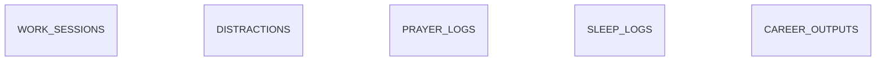

# Personal Analytics Backend

FastAPI + SQLAlchemy + SQLite backend for low-friction personal work,
distraction, sleep, prayer, and career-output logging. The analytics layer is
local-only and uses pandas; it does not call external services.

## Setup

```powershell
cd backend
python -m venv venv
.\venv\Scripts\Activate.ps1
pip install -r requirements.txt
alembic upgrade head
```

## Run and test

```powershell
uvicorn app.main:app --reload
pytest -q
ruff check app alembic tests
```

Interactive API documentation is available at `/docs`.

## Demo data

```powershell
python scripts/seed.py
```

The seed is deterministic (60 days, random seed 42) and replaces existing
domain data. It is intended for local demos only.

## Main endpoints

- Logging: `/sessions`, `/distractions`, `/sleep`, `/career-output`, `/prayers`
- Dashboard: `/today`
- Analytics: `/analytics/{kind}` and `/analytics/overview`
- Data portability: `GET /export`
- Destructive reset: `DELETE /data?confirm=true`

## Analytics limitations

Durations are tracked durations, not complete time-use measurement. Sparse data
is explicitly labeled in every analytics response. Correlations describe
association, not causation. Focus-by-hour buckets require at least three
sessions. Prayer reporting is neutral and limited to counts and percentages.

## Data model



See [docs/API_CONTRACT.md](docs/API_CONTRACT.md) for frontend integration
details and [docs/DECISIONS.md](docs/DECISIONS.md) for implementation choices.

## Errors

Every failed request returns an `error` object with a stable `code`, a
human-readable `message`, optional safe `details`, and a `request_id`. The same
request ID is returned in the `X-Request-ID` response header.

```json
{
  "error": {
    "code": "SESSION_ALREADY_ACTIVE",
    "message": "A work session is already running. Stop it before starting a new one.",
    "details": {"conflicting_id": 12},
    "request_id": "8f3c5f3e-42b9-4f32-9ef4-f0f2b0f5d1c2"
  }
}
```

Common examples:

```json
{"error": {"code": "VALIDATION_ERROR", "message": "Some fields are invalid.", "details": {"fields": [{"field": "focus_score", "message": "This value must be at most 5."}]}, "request_id": "..."}}
```

```json
{"error": {"code": "SESSION_NOT_FOUND", "message": "That work session was not found. Check the session ID and try again.", "request_id": "..."}}
```

See [docs/ERROR_CODES.md](docs/ERROR_CODES.md) for the complete code list.
