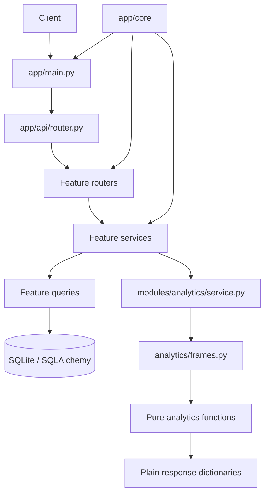

# Backend architecture

The backend separates HTTP wiring, feature behavior, persistence, and pure
analysis so each change has a small and discoverable surface.

## Request flow

`create_app()` configures middleware, exception handlers, OpenAPI
customization, and the single API router. A request enters a thin feature
router, where FastAPI parses parameters and resolves the database session. The
router calls a service. The service validates domain rules, calls small query
functions where needed, commits changes, and returns model or
schema-compatible data. Domain errors are handled centrally and retain their
stable error envelope and request ID.

Analytics requests follow the same HTTP path until the analytics service. That
service validates the requested range, loads model records, converts them to
stable DataFrame shapes, and invokes pure functions. Pure analytics code has no
database or web framework knowledge, which makes it safe to test with small
frames.

## Why the boundaries matter

- **Core isolation** prevents infrastructure from depending on application
  features and avoids circular imports.
- **Feature modules** keep models, schemas, rules, and HTTP behavior together,
  so an agent can locate a change without searching a flat application file.
- **Thin routers** prevent transport concerns from silently changing business
  behavior.
- **Services own rules** so start/stop transitions, overlap checks, and
  validation are consistent across HTTP callers and tests.
- **Small queries** make database access explicit without introducing a
  repository hierarchy.
- **Pure analytics** keeps pandas transformations deterministic and prevents
  database sessions or FastAPI objects from leaking into analysis code.
- **AST architecture tests** protect the dependency contract and the hard
  Python file-size limit.
- **OpenAPI snapshots** detect accidental endpoint or response contract changes.

## Design decisions

- Use a single FastAPI application for the MVP; routers are split by feature
  without introducing a plugin or dependency-injection framework.
- Use SQLite with SQLAlchemy 2 typed models and UTC-aware timestamps.
- Derive durations and deep-work defaults instead of storing redundant values.
- Keep the implementation dependency-light and preserve a portable SQLAlchemy
  model shape.
- Keep the generated Alembic migration intact during modularization. Only the
  model import registry moves because migration history is part of the
  database contract.
- Preserve response construction and route operation IDs while moving
  handlers. The OpenAPI baseline comparison normalizes only ordering and
  operation IDs, not endpoint paths or response shapes.
